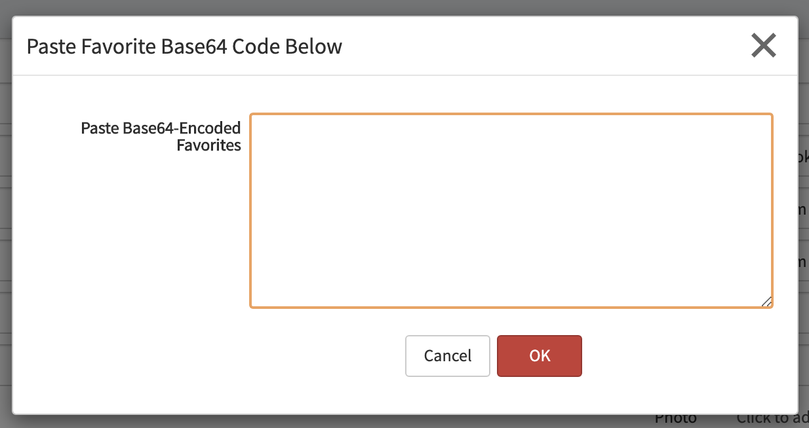

# SN User Preference Migration

## Summary
Lorem ipsum dolor sit amet, consectetur adipiscing elit, sed do eiusmod tempor incididunt ut labore et dolore magna aliqua. Ut enim ad minim veniam, quis nostrud exercitation ullamco laboris nisi ut aliquip ex ea commodo consequat. Duis aute irure dolor in reprehenderit in voluptate velit esse cillum dolore eu fugiat nulla pariatur. Excepteur sint occaecat cupidatat non proident, sunt in culpa qui officia deserunt mollit anim id est laborum.

No one will probably ever notice that this template text is still here ;) Points to you on SNDevs Slack if you notice...

## Quick Start

* Prerequsites: _none_

1. Download and install update set from [ServiceNow Share](https://developer.servicenow.com/connect.do#!/share/contents/1627055_libra_toolkit)
2. Explore features
3. Please return to the Share page and review 

### Feature One
Remove unwanted left-bar applications from your view, without impacting other users on the instance, and without modifying any records.

1. Browse to module: `Configure my minimize setting`
2. Move left-bar applications that you'd like to hide to the right column. Save.
3. To enable or disable: use `Toggle my minimize setting` module

### Feature Two
Before you zBoot your PDI, review the update sets, plugins, store apps, users, and more. Make a list of the things you need to export so it won't get lost forever.

1. Browse to module: Instance Report
2. Click `Generate Report`
3. Group-by `Type`
4. Review each category for items present in your instance
5. Can right click and `Ignore Item` or `Ignore all of this type` to remove from list
6. To export: Right-click on column header row and Export as Excel, CSV, etc...

## Contribute
Submit enhancements/defects via this repo's [Issues](../../issues)

## Credit
[Jarod Mundt](https://github.com/j4rodm)

## Screenshots

